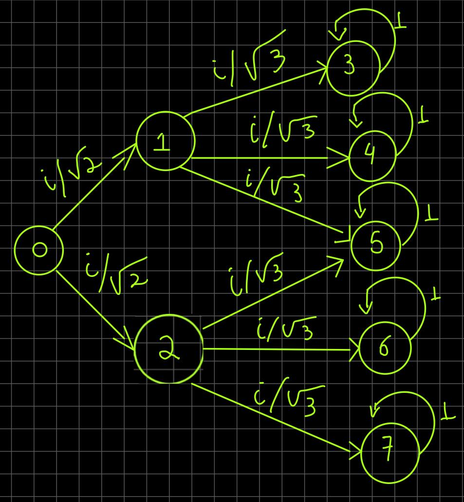

# Libreria-Capitulo3
Se presenta los siguientes casos en esta libreria:
- Los experimentos de la canicas con coeficiente booleanos
- Experimentos de las múltiples rendijas clásico probabilístico, con más de dos rendijas.
- Experimento de las múltiples rendijas cuántico.
- Cree una función para graficar con un diagrama de barras que muestre las probabilidades de un vector de estados. La imagen se debe poder guardar en el computador con un formato de imagen.
# Lenguaje
Python
# Ejecución
En cada espacio en TestLibreria de Matriz, X, Click, cont escriba los valores y condiciones que desea. Ejecute el programa y le saldran los resultados.

# COMPETENCIA DE LA DOBLE RENDIJA

En este experimento se mostrara, tres diferentes ventanas con una, dos y tres rendijas, las cuales son suficientemente pequeñas para mostrar un patron de interferencia. 

La interferencia es un fenomeno que muestra como interactuan las ondas entre si. Cuando dos ondas chcan en el mismo punto pueden apoyarse o aniquilarse entre ellas o un punto intermedio depediendo de su diferencia de fase.

## MATERIALES

1.Carton paja

2.Papel Aluminio 

3.Bisturi

4.Silicona

5.Laser

## CONSTRUCCION 

1. Se utiliza 1/8 de carton paja como base .
2. En otro 1/8 de carton de paja se realizan 3 cuadros (Medidas de los cuadros a cnveniencia) con una distancia prudente de separacio.
3. Se cortan los cuadros.
4. Se procede a colocar papel alumino llenando los cuadros.
5. En un 1/8 de carton paja con el bisturi se realizara la cantidad de rendijas correspondientes a cada cuadro(1,2 y 3 rendijas) procurando que el laser logre cubrir a lo ancho las rendijas.
6. Al final de la base se ubica un 1/8 de carton paja, en cual nos permitira capturar la luz del laser.
7. En la mitad de la base se creara una corrediza para el 1/8 de carton paja que contiene la ventanas con las rendijas ( Esta nos permitira apreciar el experimento por las tres diferentes ventanas).
8. Se ubica el 1/8 de carto paja con las ventanas en la corrrediza de la mitad de la base
9. Se unbica de forma estatica el laser al inicio de la base, procurando que la altura corresponda a la de las ventanas.

*Para un resultado de:*

## EXPLICACION
En este experimento vamos a utilizar un laser que arroja punto de luz, reflejandose una placa de papel aluminio con dos rendijas. Los electrones que conforman el laser de luz tienen la misma posibilidad de atravesar por alguna de las dos redijas, esto quiere decir que no puede pasar por las dos.

## SIMULACION 1 RENDIJA

## GRAFO

## SIMULACION 2 RENDIJAS

## GRAFO

## SIMULACION 3 RENDIJAS

## GRAFO

## USO 

Se enciende el laser y se dezplazan las ventanas por medio de la corrediza. 

# Presentado por:
Juan Pablo Sánchez Suárez 
Brayan Alexis Jiménez Moya 
Santiago Agustin Laiton Cubides

